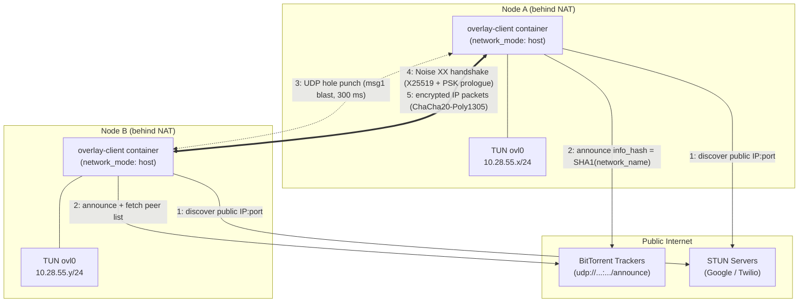

# APGO (A Pretty Good Overlay)

A self-organizing, encrypted peer-to-peer overlay network written in Go. Nodes discover each other through public BitTorrent trackers (and LAN broadcast), punch through NAT with STUN-assisted UDP hole punching, and establish end-to-end encrypted tunnels using the Noise XX protocol. Each node exposes a Linux TUN interface (`ovl0`), so any IP traffic — SSH, HTTP, ping, anything — flows over the overlay as if the machines shared a private LAN.

**No central server. No VPN provider. No port forwarding.** Just two or more machines, anywhere on the internet, that find each other and talk privately.

## License — Free and Open Source, Iron-Clad

**APGO is free software, licensed under the GNU General Public License, version 3 or (at your option) any later version (GPL-3.0-or-later).** The complete, unmodified license text is in [`LICENSE`](LICENSE) at the root of this repository.

This means — permanently and irrevocably for every copy ever distributed:

- **You are free to use** this software for any purpose, commercial or non-commercial, with no fee and no permission required.
- **You are free to study and modify** the source code. The full source is right here.
- **You are free to redistribute** exact copies, to anyone, by any means.
- **You are free to distribute modified versions**, provided they are also licensed under the GPL, so the same freedoms pass to everyone downstream (copyleft).
- **No one can ever close it.** Under GPLv3 §10, every recipient automatically receives a license from the original licensors. Under §8, your rights cannot be terminated as long as you comply. No future maintainer can revoke the license on copies you already have.

There is **no warranty**, as stated in GPLv3 §15–16. If a file in this repository lacks a license header, it is nevertheless covered by the GPL-3.0-or-later license of the project as a whole.

```
APGO (A Pretty Good Overlay)
Copyright (C) 2026  APGO contributors

This program is free software: you can redistribute it and/or modify
it under the terms of the GNU General Public License as published by
the Free Software Foundation, either version 3 of the License, or
(at your option) any later version.

This program is distributed in the hope that it will be useful,
but WITHOUT ANY WARRANTY; without even the implied warranty of
MERCHANTABILITY or FITNESS FOR A PARTICULAR PURPOSE.  See the
GNU General Public License for more details.

You should have received a copy of the GNU General Public License
along with this program.  If not, see <https://www.gnu.org/licenses/>.
```

## How It Works



A standalone shareable diagram is in [`docs/apgo-architecture.svg`](docs/apgo-architecture.svg).

### The life of a connection

1. **Identity.** On first start each node generates an X25519 keypair (`node.key`). The public key deterministically derives the node's stable overlay IP inside `overlay_cidr` — no per-node address configuration needed.
2. **Rendezvous.** All nodes sharing a `network_name` announce to public BitTorrent trackers under `info_hash = SHA1(network_name)`. The tracker never sees any payload — it's used purely as a peer-address bulletin board. Same-subnet peers also find each other instantly via a LAN broadcast beacon.
3. **NAT traversal.** Each node learns its public `IP:port` mapping via STUN, keeps the mapping stable with a fixed listen port (default `6969`), and hole-punches by blasting handshake msg1 at 300 ms intervals for up to 8 s — enough to survive announce skew between peers.
4. **Encryption.** Peers run a **Noise XX** handshake (X25519, ChaCha20-Poly1305, BLAKE2b) with the network's pre-shared key mixed into the prologue — a node that doesn't know the PSK cannot complete a handshake, even if it finds you through the tracker. Data packets carry an explicit 8-byte nonce with a 64-entry sliding window for replay protection.
5. **Tunneling.** Decrypted packets are written to the `ovl0` TUN device; the kernel routes them like any other interface. Optional LZ4 compression for packets ≥ 64 bytes.

### Repository layout

| Path | Purpose |
|---|---|
| `client/` | Go client: TUN, tracker announce, STUN, hole punching, Noise sessions |
| `client/sessions.go` | Noise XX handshake state machine, replay window, session table |
| `client/main.go` | Config, overlay-IP derivation, tracker/STUN/discovery loops |
| `config/client.yaml` | Shared network config (identical on every node) |
| `config/trackers.txt` | Public tracker list |
| `docker-compose.template.yml` | Single compose template used by every node |
| `deploy.sh` | Idempotent deploy/test/teardown script (run on each node) |
| `.forgejo/workflows/pipeline.yml` | CI: ships the repo to servers and runs `deploy.sh` |

## Deployment

### Requirements

- Linux host with `/dev/net/tun`
- Docker (or Podman — `deploy.sh` shims it automatically) with the compose plugin
- Outbound UDP allowed (trackers, STUN, and peer traffic; default listen port `6969/udp`)

### 1. Configure your network

Edit `config/client.yaml` — the same file goes on **every** node:

```yaml
network_name: "my-overlay-CHANGE-ME"     # unique name; defines the swarm
psk: "base64:<GENERATE YOUR OWN>"        # openssl rand -base64 32
overlay_cidr: "10.28.55.0/24"            # private subnet for the overlay
udp_listen_port: 6969
```

Generate a fresh PSK once and copy it to all nodes:

```bash
echo "base64:$(openssl rand -base64 32)"
```

### 2. Deploy on each node

```bash
git clone <this-repo> && cd apgo
./deploy.sh                # clean build + bring the stack up
./deploy.sh --test         # verify the overlay reaches the other node(s)
./deploy.sh --deploy-test  # both in one shot
./deploy.sh --down         # full cleanup, leave stack down
```

`deploy.sh` starts from a clean slate every run: it tears down the old stack, wipes `active-config/` (regenerating `node.key`), substitutes the config directory into the compose template, and brings the container up with `network_mode: host` + `NET_ADMIN` + `/dev/net/tun` (all three are required for TUN and reliable hole punching).

Useful env knobs: `SKIP_BUILD=1` (no rebuild), `FRESH_BUILD=1` (no-cache rebuild), `TEST_MAX_WAIT=360`.

### 3. Per-node overrides (optional)

Machine-local settings live **outside** the repo so they survive redeploys:

```bash
echo "OVERLAY_ADDRESS=10.28.55.2" | sudo tee /etc/overlay-node.env
```

Without a pin, the node auto-derives a stable IP from its key. Other config extras: `static_peers` (dial known endpoints immediately), `tracker_mode: "passive"` (announce port 0 — receive the peer list without appearing in it), inline `trackers`, `compression`.

### 4. Verify

```bash
docker logs -f overlay-client      # watch: TUN address, info_hash, handshakes
ping 10.28.55.X                    # the other node's overlay IP
```

### CI deployment

Pushes to `main` trigger the Forgejo workflow, which ships the repo to each server and runs `./deploy.sh` there (node role via the `SERVER_NUM` matrix variable).

## Making It Safe

The overlay's security rests on two secrets and a handful of operational rules. Read this section before exposing anything real over the network.

**1. Generate your own PSK — never ship the example one.** The PSK in `config/client.yaml` / `client/config.yaml.example` is a public example value. Anyone who has read this repo knows it. Replace it (`openssl rand -base64 32`) before first deployment. The PSK is mixed into the Noise prologue, so a peer without it cannot complete a handshake — but only if it's actually secret.

**2. Use a unique, unguessable `network_name`.** The tracker rendezvous point is `SHA1(network_name)`. A guessable name lets strangers *find* your nodes (the PSK still stops them from *joining*, and the tracker never sees traffic contents — but why advertise?). Include a random suffix, e.g. `myteam-overlay-$(openssl rand -hex 4)`.

**3. Protect the key material.** `active-config/node.key` (node identity) and the PSK are the crown jewels. Keep them out of git, out of logs, and readable only by root. Rotating the PSK evicts every peer that doesn't get the new one — that *is* the member-removal mechanism, so rotate whenever a machine leaves the network or may be compromised.

**4. Firewall the overlay interface.** Joining the overlay is authentication, not authorization. Every peer holding the PSK can reach every port on your `ovl0` IP. Treat `ovl0` like any LAN interface:

```bash
# allow only SSH from the overlay, drop the rest
sudo iptables -A INPUT -i ovl0 -p tcp --dport 22 -j ACCEPT
sudo iptables -A INPUT -i ovl0 -j DROP
```

Also confirm no service unintentionally binds `0.0.0.0` on the host — `network_mode: host` means container ports are host ports.

**5. Limit host exposure.** Only `6969/udp` needs to be reachable (outbound-initiated is enough behind NAT; no inbound firewall rule required). Don't forward anything else. The container needs `NET_ADMIN` and the TUN device but no other privileges.

**6. Prefer `tracker_mode: "passive"` for sensitive nodes.** Passive nodes announce with port 0, so they receive the swarm peer list without being listed themselves — useful for laptops or admin machines that should dial out but never be discoverable.

**7. Know the threat model's edges.**

- Trackers and STUN servers learn your public IP and (for trackers) the info_hash — that's metadata, not content. If that matters, run your own private tracker and put its URL in `trackers`.
- The PSK is a *shared* secret: any member can invite an eavesdropper. For high-trust boundaries, run separate networks with separate PSKs rather than one big one.
- LAN discovery beacons (`OVLY1:<infohash>:<port>`) are broadcast in plaintext on the local subnet. They carry no secrets and joining still requires the Noise handshake + PSK, but they do reveal that an overlay node exists on that LAN.
- Sessions use ephemeral X25519 keys (Noise XX), so each session has forward secrecy — but a leaked PSK + node key compromises authentication until you rotate them.

**8. Keep dependencies fresh.** The crypto lives in `flynn/noise` and `golang.org/x/crypto`. Rebuild with `FRESH_BUILD=1` periodically to pick up patched base images and modules.

## Copying

This program is free software: you can redistribute it and/or modify it under the terms of the GNU General Public License as published by the Free Software Foundation, either version 3 of the License, or (at your option) any later version. See [`LICENSE`](LICENSE) for the full text.

## Donations
If you found this software helpful please support by buying me a cup of coffee or something. YOU DO NOT HAVE TO DONATE TO ENJOY!!! 

Anything is appreciated! 

CashAPP: $APGOverlay 
Monero : 463y7FwfniMAsR2a3hQAQCh4FVuv2bKU86yFBj1SGUmkdgieFi2U4qaSuyyJNfgqEHd7gciN8YfnuGES3dEb1uimLnaQSTr

