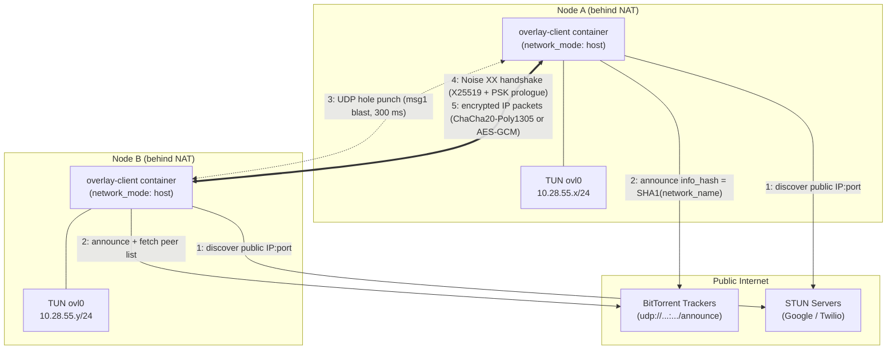

# APGO (Another Pretty Good Overlay)

**Website: [https://www.apgoverlay.com](https://www.apgoverlay.com)**

A self-organizing, encrypted peer-to-peer overlay network written in Go. Nodes discover each other through public BitTorrent trackers (and LAN broadcast), punch through NAT with STUN-assisted UDP hole punching, and establish end-to-end encrypted tunnels using the Noise XX protocol. Each node exposes a Linux TUN interface (`ovl0`), so any IP traffic — SSH, HTTP, ping, anything — flows over the overlay as if the machines shared a private LAN.

**No central server. No VPN provider. No port forwarding. No static IP.** Just two or more machines, anywhere on the internet, that find each other and talk privately. The transport is dual-stack and NAT-adaptive: it connects directly over IPv6 where available, auto-opens a router port via NAT-PMP/PCP on IPv4, and falls back to STUN hole punching and peer relay — so it self-heals across home routers, phone hotspots, and CGNAT.

## License — Free and Open Source, Iron-Clad

**APGO is free software, licensed under the GNU General Public License, version 3 or (at your option) any later version (GPL-3.0-or-later).** The complete, unmodified license text is in [`LICENSE`](LICENSE) at the root of this repository.

This means — permanently and irrevocably for every copy ever distributed:

- **You are free to use** this software for any purpose, commercial or non-commercial, with no fee and no permission required.
- **You are free to study and modify** the source code. The full source is right here.
- **You are free to redistribute** exact copies, to anyone, by any means.
- **You are free to distribute modified versions**, provided they are also licensed under the GPL, so the same freedoms pass to everyone downstream (copyleft).
- **No one can ever close it.** Under GPLv3 §10, every recipient automatically receives a license from the original licensors. Under §8, your rights cannot be terminated as long as you comply. No future maintainer can revoke the license on copies you already have.

There is **no warranty**, as stated in GPLv3 §15–16. If a file in this repository lacks a license header, it is nevertheless covered by the GPL-3.0-or-later license of the project as a whole.

```
APGO (Another Pretty Good Overlay)
Copyright (C) 2026  The APGO Team

This program is free software: you can redistribute it and/or modify
it under the terms of the GNU General Public License as published by
the Free Software Foundation, either version 3 of the License, or
(at your option) any later version.

This program is distributed in the hope that it will be useful,
but WITHOUT ANY WARRANTY; without even the implied warranty of
MERCHANTABILITY or FITNESS FOR A PARTICULAR PURPOSE.  See the
GNU General Public License for more details.

You should have received a copy of the GNU General Public License
along with this program.  If not, see <https://www.gnu.org/licenses/>.
```

## How It Works



A standalone shareable diagram is in [`docs/apgo-architecture.svg`](docs/apgo-architecture.svg).

### The life of a connection

1. **Identity.** On first start each node generates an X25519 keypair (`node.key`). The public key deterministically derives the node's stable overlay IP inside `overlay_cidr` — no per-node address configuration needed.
2. **Rendezvous.** All nodes sharing a `network_name` announce to public BitTorrent trackers under `info_hash = SHA1(network_name)`. The tracker never sees any payload — it's used purely as a peer-address bulletin board. Same-subnet peers also find each other instantly via a LAN broadcast beacon.
3. **NAT traversal.** Each node learns its public `IP:port` mapping via STUN, keeps the mapping stable with a fixed listen port (default `6969`), and hole-punches by blasting handshake msg1 at 300 ms intervals for up to 8 s — enough to survive announce skew between peers.
4. **Encryption.** Peers run a **Noise XX** handshake (X25519, BLAKE2b) with the network's pre-shared key mixed into the prologue — a node that doesn't know the PSK cannot complete a handshake, even if it finds you through the tracker. The AEAD used for both the handshake and the data tunnel is selectable per network via `cipher`: **ChaCha20-Poly1305** (default — constant-time in software on any CPU) or **AES-256-GCM**, which runs on hardware AES instructions (AES-NI on x86, the crypto extensions on ARMv8) for a substantial throughput gain on modern hardware. The value must be identical on every node, or handshakes fail. Data packets carry an explicit 8-byte nonce with a 64-entry sliding window for replay protection.
5. **Tunneling.** Decrypted packets are written to the `ovl0` TUN device; the kernel routes them like any other interface. Optional LZ4 compression for packets ≥ 64 bytes.

### Repository layout

| Path | Purpose |
|---|---|
| `client/` | Go client: TUN, tracker announce, STUN, hole punching, Noise sessions |
| `client/sessions.go` | Noise XX handshake state machine, replay window, session table |
| `client/main.go` | Config, overlay-IP derivation, tracker/STUN/discovery loops |
| `client/control.go` | Local admin control socket: list + revoke live sessions |
| `client/rendezvous.go` | HTTP(S) discovery for networks that block BitTorrent |
| `admin/` | Standalone web dashboard container (node status, sessions, log, revoke, edit, admin key) |
| `rendezvous/` | Tiny standalone HTTPS discovery server (tracker alternative) |
| `desktop/` | macOS + Windows menu-bar/tray app (client + built-in admin panel) |
| `ios/`, `android/` | Native mobile apps (NetworkExtension / VpnService) over the shared Go core |
| `config/client.yaml` | Shared network config (identical on every node) |
| `config/trackers.txt` | Public tracker list |
| `easy-deploy.sh` | One-command build + up for a single host (podman/docker) |
| `easy-compose.yml` | Compose stack used by `easy-deploy.sh` (`overlay-client` / `overlay-admin`) |
| `apgoclient.containerfile`, `apgoadmin.containerfile` | Image builds for the client and dashboard |

## Deployment

### Requirements

- Linux host with `/dev/net/tun`
- Podman **or** Docker (with the compose plugin). `easy-deploy.sh` auto-detects whichever you have.
- Outbound UDP allowed (trackers, STUN, and peer traffic; default listen port `6969/udp`)

### 1. Deploy on each node (easy path)

The simplest way to run a node is `easy-deploy.sh`. It builds the two images locally from the root Containerfiles and brings the stack up with `easy-compose.yml` — no registry, no Kubernetes.

```bash
git clone <this-repo> && cd apgo
./easy-deploy.sh            # build images + start the stack
./easy-deploy.sh --rebuild  # force a fresh (no-cache) build, then start
./easy-deploy.sh --down     # stop and remove the stack
```

On the **first** run it writes a `.env` with a freshly generated `PSK` and a random dashboard password, and prints them. This `.env` is the network identity — **copy the same `NETWORK_NAME` and `PSK` to every node/device that should join**:

```
NETWORK_NAME=apgo-xxxxxxxx     # same on every node — defines the swarm
PSK=base64:...                 # same on every node — the membership secret
OVERLAY_CIDR=10.28.55.0/24     # private subnet for the overlay
FRIENDLY_NAME=<hostname>
EXIT_NODE=                      # set to 1 to make this host an internet exit
RENDEZVOUS_SERVERS=            # optional HTTPS discovery (BitTorrent-blocked nets)
ADMIN_USER=admin
ADMIN_PASSWORD=...             # dashboard login (local to this node)
```

The stack comes up **quantum-protected, dual-stack, and NAT-adaptive by default** — you don't configure any of that (see below). The container runs with `network_mode: host` + `NET_ADMIN` + `/dev/net/tun` (all three required for TUN and reliable hole punching).

You must also populate `config/trackers.txt` with public trackers (one per line; an example is included). Lists can be found online — please make sure the trackers you use are okay with this type of use. Peer discovery puts no more stress on a tracker than sharing a personal torrent, but at scale this is a grey area, so be considerate.

### 2. Reachability — automatic, no VPS, no static IP

Every node picks the best path to its peers on its own, in this order:

- **IPv6 (best).** The transport binds dual-stack. Where a node has a routable IPv6 address (many home ISPs and phone hotspots), peers connect **directly over v6 with no NAT** — this is what fixes CGNAT/hotspot reachability. The overlay itself stays IPv4 (`10.28.55.x`), so nothing changes for you.
- **NAT-PMP / PCP auto port-mapping.** On IPv4, a home node asks its own router to open its listen port automatically — no port-forward, no static IP. Watch for `[portmap] SUCCESS` in the log.
- **Symmetric-NAT port prediction** (on by default) + **STUN hole punching**.
- **Relay through a connected peer** as the final fallback.

The only case that can't self-heal is when *every* node is behind NAT with no IPv6 anywhere — then make one node reachable (IPv6, the auto port-map, or one forwarded port) and the rest connect through it.

### 3. Per-node overrides (optional)

Set machine-local values in `.env` (or the environment). Common ones:

- `OVERLAY_ADDRESS=10.28.55.2` — pin this node's overlay IP (otherwise auto-derived from its key).
- `EXIT_NODE=1` — make this host a full-VPN exit / outproxy.
- `POST_QUANTUM=0`, `PQ_AUTH=0`, `PORT_PREDICTION=0` — opt out of a default (keep the fleet consistent).
- `RENDEZVOUS_SERVERS=https://rv.example.com` — HTTPS discovery for BitTorrent-blocked networks.

For raw-config deployments, `config/client.yaml` exposes the same settings plus `static_peers`, `tracker_mode: "passive"`, inline `trackers`, `compression`, and `cipher` (`chacha` or `aesgcm`).

### 4. Verify

```bash
docker logs -f overlay-client      # or: podman logs -f overlay-client
# watch for: TUN address, matching info_hash across nodes, handshakes, [portmap]
ping 10.28.55.X                    # the other node's overlay IP
```

### Start over / wipe a node completely

The stack persists state (including the network admin key/password) in the named volumes `overlay-state`, `overlay-shared`, and `overlay-adminkey`. **`down` alone keeps those volumes** — to truly start fresh you must remove them. The containers are named `overlay-client` / `overlay-admin` (not `apgo-*`):

```bash
# Docker
docker rm -f overlay-client overlay-admin 2>/dev/null
docker volume rm -f overlay-state overlay-shared overlay-adminkey 2>/dev/null

# Podman
podman rm -f overlay-client overlay-admin 2>/dev/null
podman volume rm -f overlay-state overlay-shared overlay-adminkey 2>/dev/null
```

Two things make a fleet-wide reset actually stick: wipe **every** node in the same sitting (a single un-wiped node re-seeds the old admin key to the others via trust-on-first-use), or simpler — **rotate `NETWORK_NAME` and `PSK`** so any straggler is on a different swarm entirely and physically can't seed to the new one. As a one-shot alternative to deleting volumes, set `APGO_RESET_ADMIN=1` for a single boot to wipe just the admin key/password on that node.

### Discovery on networks that block BitTorrent

Peer **discovery** uses BitTorrent trackers (each node announces `SHA1(network_name)` to find others). The **data plane is not BitTorrent** — it's Noise-encrypted UDP on your own port — so the tunnel itself isn't affected by torrent filters. But if a node sits on a network that blocks BitTorrent, it can't discover peers through trackers. Two ways to handle that:

**Option A — static peers (no extra infrastructure).** Point the blocked node at any always-on node with a reachable endpoint:

```yaml
static_peers: ["203.0.113.10:6969"]
```

It bootstraps directly off that node; once connected, endpoint-roaming (PEX) and relaying keep the mesh together.

**Option B — HTTPS rendezvous (automatic discovery).** Run the small server in `rendezvous/` on any host, behind TLS on 443. It's a drop-in alternative to a tracker but speaks plain HTTPS, so filters that block torrents let it through. It only exchanges endpoints (like a tracker) — it never sees keys or the PSK, so it can't join or read the overlay.

```bash
docker build -t apgo-rendezvous ./rendezvous
docker run -d -p 8080:8080 apgo-rendezvous   # then put TLS/443 in front
```

You don't need a static IP — a **Cloudflare Tunnel** (or any reverse proxy) works, since the rendezvous is ordinary HTTP request/response. Run it in plain-HTTP mode and let Cloudflare terminate TLS: `ingress: [{hostname: rv.example.com, service: http://localhost:8080}]`.

Then set the **same value on every node** that should find each other:

- **Docker:** `RENDEZVOUS_SERVERS=https://rv.example.com` (in `/etc/overlay-node.env`).
- **macOS/Windows app:** Settings → *Discovery servers*.
- **Raw config:** `rendezvous_servers: ["https://rv.example.com"]`.

Trackers still run alongside it, so a mixed fleet (some blocked, some not) converges. Note the tunnel/proxy only carries discovery — nodes still connect to each other **directly over UDP** for the actual data, using STUN + hole punching, with relay through another node as a fallback. See `rendezvous/README.md` for full details.

### Full VPN via an exit node (outproxy)

By default APGO only carries traffic **between** overlay nodes. You can also use
it as a full VPN: route *all* your internet traffic out through one of your nodes.

- **Make a node an exit.** On a Linux node set `EXIT_NODE=1` (compose env, or
  `exit_node: true` in config). It enables IP forwarding + NAT and advertises
  itself as an exit to the mesh. Exit nodes must be Linux (they use `iptables`);
  they need `NET_ADMIN`, which the compose stack already grants.
- **Use it.** Flip **Full VPN** in the iOS/Android app or the macOS/Windows
  app's Settings (raw client: `use_exit: true` / `USE_EXIT=1`). The client
  routes every non-overlay packet to the exit, so all your traffic egresses
  there. On macOS/Windows the client also installs the two half-default routes
  (`0.0.0.0/1` + `128.0.0.0/1`) via the overlay TUN and pins its transport
  socket to the physical interface, so no extra routing setup is needed.
- **Pick the exit.** Two modes:
  - **Fastest (default).** Leave the exit choice blank and the client picks the
    **fastest** reachable exit automatically (latency-probed), re-measures every
    ~5 minutes, and switches if the current exit goes down or a faster one
    appears.
  - **Pinned.** Choose one specific node as the outproxy — by its overlay IP,
    friendly name, base64 public key, or key-fingerprint prefix. All internet
    traffic egresses **only** there; if it goes offline, traffic pauses (it is
    never silently re-routed to another exit). Set it in the apps' *Exit node*
    field, or `exit_peer: "10.28.55.7"` / `EXIT_PEER=…` on the raw client. On a
    running node you can also switch live via the control socket:
    `POST /api/exit-pin {"pin":"10.28.55.7"}` (empty pin = back to fastest),
    and list advertised exits with `GET /api/exits`.

The overlay is IPv4: on a network with native IPv6, v6 traffic keeps using the
normal v6 default route (disable IPv6 on the host if that matters to you).

Traffic is Noise-encrypted from your device to the exit, then exits to the
internet from the exit node's IP — so pick an exit you trust, since it sees your
cleartext internet traffic just like any VPN provider would.

### 5. Admin dashboard (optional)

A separate **`overlay-admin`** container ships in the same compose stack. It serves a small web dashboard — protected by a username and password — that shows this node's connected peers and a live tail of the client log, and lets you **revoke** (kick) a peer with one click.

It runs in its own container and talks to the client only over a unix socket on a private shared volume, so no control port is exposed on the network. Set credentials before deploying (they're read from the environment, and `deploy.sh` exports `/etc/overlay-node.env`):

```bash
sudo tee -a /etc/overlay-node.env >/dev/null <<'EOF'
ADMIN_USER=admin
ADMIN_PASSWORD=<pick a strong password>
ADMIN_PORT=8088
EOF
./deploy.sh
```

Then browse to `http://<node-ip>:8088` and sign in. The page auto-refreshes every few seconds and follows your browser's light/dark setting.

- **Connected nodes** — overlay IP, peer endpoint, direction, a short key fingerprint, session age and last-seen.
- **Revoke** — kicks the peer. With no admin key configured (below) this is a local, temporary kick (`REVOCATION_TTL_SECONDS`, default 1800s). With an admin key, it's a **permanent, admin-signed** revocation that tears down the session and blocks that key from reconnecting in both directions.
- **Revoked peers / Accept** — revoked peers are listed with an **Accept** button that signs a `restore` and re-admits them.
- **Client log** — a live tail of the node's log.

#### Admin key & password (manage from any node)

**Two different passwords — don't confuse them.** The **dashboard login** (username + password) just protects access to a node's admin web UI; it's local to that device. The **network admin password** is something else: it encrypts the network's Ed25519 *signing key* and is what you type to authorize network actions — revoke/approve a device, set another node's IP or name, rotate the PSK, toggle post-quantum. Every prompt that performs a signed network action is labelled **"Network admin password"** to keep them distinct.

Revocations and node changes (assigning a node a new overlay IP or friendly name) are **signed by the admin key** that every node verifies, so no single node can forge one. The admin key is Ed25519, encrypted at rest with the network admin password (PBKDF2 + AES-256-GCM). The plaintext key is never written to disk and never crosses the wire — it's decrypted only in memory, for the instant it signs, then wiped.

**The encrypted key is distributed to every node.** When you create it, the password-encrypted blob is gossiped across the overlay (only ciphertext ever leaves a node) and superseded by an epoch. That means you can manage the network from **any** node's admin panel: enter the network admin password there and that node decrypts the blob locally to sign — you never have to be on the machine that created the key.

**Trust-on-first-use — first come, first served.** A node that holds **no** admin key adopts the first one it hears over the tunnel and starts trusting it (and, being connected, grandfathers its current peers so nobody is dropped). So if you set the network admin password on one node as the network is coming up, every node that doesn't yet have a key accepts it automatically. Once a node holds a key, **gossip can only update that same key** — e.g. a **password change** (which re-encrypts the *same* signing key under the new password, bumps the epoch, and floods the mesh so every node's copy updates). A *different* key arriving by gossip is refused, so no peer can silently swap in another admin key. To deliberately **reset** the key to a different one on a node that already holds a stale key, do it locally on that node (create/enter the key in its own admin panel — a local, authenticated action can replace it), or wipe that node's state and let it re-adopt via TOFU.

**Every admin action is seeded continuously.** Approvals, revocations, node IP/name changes, network-name/PSK rotation, the post-quantum policy, and the encrypted admin key itself are all re-flooded to peers on every keepalive as well as immediately when you make them — so any node that reconnects or joins later converges on the current state, and **any node holding the key can approve every other node**. The security boundary is the PSK: only devices already inside the network can gossip anything at all — keep it secret and rotate it (Network → rotate) if it's ever exposed.

Create it once, any of these ways:

- **Container dashboard** — the *Admin key* page → set a password → *Create admin key*.
- **macOS/Windows app** — Settings → *Create network admin key*.
- **CLI** — `echo -n 'your-admin-password' | podman exec -i overlay-admin overlay-admin genkey` (prints an `ADMIN_PUBLIC_KEY=...` line).

Once it exists, both the public key and the encrypted blob auto-seed to every node over the tunnel — no need to hand-copy `ADMIN_PUBLIC_KEY` into each node's env (you still can, and an explicit env value always wins).

With an admin key in place:

- **Revoke / Accept** — permanent, signed, gossiped network-wide; blocks/re-admits a peer key in both directions and survives restarts (via the `/var/lib/overlay` bind mount).
- **Edit node** — assign any node a new overlay IP and/or friendly name from the dashboard's per-peer *Edit* button (or *Edit this device*). The target applies it automatically and silently: the name live, the IP by re-addressing its interface in place (no restart, no prompt). Signed and gossiped like a revocation. (Mobile adopts an assigned IP on its next reconnect.)
- **Create or change the admin password** — under **Settings** on every panel: if no key exists you set one (typed twice to confirm); if one exists you change it by entering the current password and the new one twice. It re-encrypts the key and redistributes it network-wide.
- **Rotate network name + PSK** — under **Settings**, change the network name and/or PSK (with a one-click random PSK **Generate**). Signed and flooded to every connected device, which reconnects under the new identity. This is the "the network was compromised" lever — devices that are revoked or offline don't get the new identity and are shut out.
- **Manage trackers** — edit the tracker list (one per line) under **Settings**; changes apply within a minute, no restart.
- **Toggle post-quantum / IPv6** — post-quantum flips network-wide or per node; IPv6 dual-stack transport is a per-node toggle. Both live under **Settings** on every version of the app.

### Approve / revoke devices

Membership control is done with two signed, gossiped actions, and does **not** silently blackhole traffic:

- **Revoke** is the hard block. It tears down the device's session, refuses its handshake network-wide, **and blocks its overlay IP at the data plane on every node** — including relayed paths — so a revoked device can't be reached at all (you can't even ping it). Signed by the admin key, gossiped, and persistent.
- **Approve** is a soft **trust marker**. When the network has an admin key, devices that haven't been explicitly approved show as **pending** in the dashboard's node list; approving one (in-page, password-gated) records a signed approval and clears the badge. It's for visibility — "have I vetted this device?" — and does not gate the data plane, so approving a device is never required for it to work and a device is never cut off just for being un-approved.

This is deliberately fail-open: a device that completes the encrypted handshake (it has the PSK) gets normal overlay service, and you remove unwanted devices with **Revoke**. Earlier builds hard-blocked un-approved devices at the data plane, which could black out a whole mesh if an admin key was adopted with nobody actively approving — that enforcement has been removed.

This pairs with the PSK/name rotation above: revoke or simply don't approve a device, rotate if needed, and it can't get back on.

Enter the admin password only over your encrypted tunnel or TLS — a wrong password simply fails to decrypt. Security trade-off: because the encrypted key now lives on every node, anyone who can read a node's disk **and** knows or brute-forces the password could sign — so use a strong admin password (it's protected by PBKDF2 + AES-256-GCM).

Because you're exposing it on a node port, prefer to reach it over the overlay itself, a trusted LAN, or an SSH tunnel — or set `ADMIN_TLS_CERT` / `ADMIN_TLS_KEY` (paths inside the container) to serve HTTPS. The dashboard is only as private as the network you expose port 8088 on. If `ADMIN_PASSWORD` is unset the admin container refuses to start (the client is unaffected).

## Encryption & post-quantum

The tunnel is **quantum-protected by default** — you don't configure anything. The base layer is **Noise XX**: an X25519 handshake with the network PSK bound in, and **ChaCha20-Poly1305 or AES-256-GCM** for the data (`cipher: aesgcm` uses AES-NI hardware acceleration on x86 and is the recommended default). On top of that, three independently quantum-resistant layers make every part that matters safe against a future quantum computer:

- **Confidentiality — ML-KEM-768** (Kyber, FIPS 203). Peers run a key encapsulation *inside* the already-authenticated Noise channel and wrap traffic in a second AEAD keyed by the ML-KEM secret, negotiated in one round-trip at session start. It's **hybrid** (you're safe if *either* X25519 or ML-KEM holds) and **harvest-now-decrypt-later resistant**. Everything on a direct session is wrapped — data, relayed packets, exit-node traffic, and the control frames that gossip the encrypted admin key.
- **Authentication — PSK in the key schedule (XXpsk0, `pq_auth`).** The PSK is mixed into the Noise key schedule, not just the prologue, so even an *active* quantum-capable MITM can't read traffic or impersonate a member without the PSK. This is PQ from the very first packet.
- **Control plane — ML-DSA-65** (Dilithium, FIPS 204). The network admin key is a post-quantum signature keypair, so revoke/approve/assign-IP/rotate/policy actions can't be forged. The 32-byte seed is encrypted at rest (PBKDF2 + AES-256-GCM) and distributed; the keypair derives from it.

The only residual is a brief (~1 RTT) window at session start where *data* is classical before ML-KEM is negotiated — authentication is PQ from the first packet.

**Turning it off (rarely needed).** `post_quantum` and `pq_auth` are per-node toggles (config, `POST_QUANTUM`/`PQ_AUTH` env, or the app settings), and post-quantum can also be flipped **network-wide** from any admin panel (ML-DSA-signed, gossiped, applied live). PQ confidentiality only engages when *both* peers have it on and never drops traffic on a mixed rollout; `pq_auth` changes the handshake wire format, so if you disable it, do so on **every** node.

**Performance.** One ML-KEM handshake per peer at connect (sub-millisecond) plus a second AEAD and ~36 bytes/packet — roughly a 5–15% throughput cost depending on CPU. On small-MTU paths, lower the tunnel MTU a little (e.g. `tun.mtu: 1240`) to avoid fragmentation.

## Making It Safe

The overlay's security rests on two secrets and a handful of operational rules. Read this section before exposing anything real over the network.

**1. Generate your own PSK — never ship the example one.** The PSK in `config/client.yaml` / `client/config.yaml.example` is a public example value. Anyone who has read this repo knows it. Replace it (`openssl rand -base64 32`) before first deployment. The PSK is mixed into the Noise prologue, so a peer without it cannot complete a handshake — but only if it's actually secret.

**2. Use a unique, unguessable `network_name`.** The tracker rendezvous point is `SHA1(network_name)`. A guessable name lets strangers *find* your nodes (the PSK still stops them from *joining*, and the tracker never sees traffic contents — but why advertise?). Include a random suffix, e.g. `myteam-overlay-$(openssl rand -hex 4)`.

**3. Protect the key material.** `active-config/node.key` (node identity) and the PSK are the crown jewels. Keep them out of git, out of logs, and readable only by root. Rotating the PSK evicts every peer that doesn't get the new one — that *is* the member-removal mechanism, so rotate whenever a machine leaves the network or may be compromised.

**4. Firewall the overlay interface.** Joining the overlay is authentication, not authorization. Every peer holding the PSK can reach every port on your `ovl0` IP. Treat `ovl0` like any LAN interface:

```bash
# allow only SSH from the overlay, drop the rest
sudo iptables -A INPUT -i ovl0 -p tcp --dport 22 -j ACCEPT
sudo iptables -A INPUT -i ovl0 -j DROP
```

Also confirm no service unintentionally binds `0.0.0.0` on the host — `network_mode: host` means container ports are host ports.

**5. Limit host exposure.** Only `6969/udp` needs to be reachable (outbound-initiated is enough behind NAT; no inbound firewall rule required). Don't forward anything else. The container needs `NET_ADMIN` and the TUN device but no other privileges.

**6. Prefer `tracker_mode: "passive"` for sensitive nodes.** Passive nodes announce with port 0, so they receive the swarm peer list without being listed themselves — useful for laptops or admin machines that should dial out but never be discoverable.

**7. Know the threat model's edges.**

- Trackers and STUN servers learn your public IP and (for trackers) the info_hash — that's metadata, not content. If that matters, run your own private tracker and put its URL in `trackers`.
- The PSK is a *shared* secret: any member can invite an eavesdropper. For high-trust boundaries, run separate networks with separate PSKs rather than one big one.
- LAN discovery beacons (`OVLY1:<infohash>:<port>`) are broadcast in plaintext on the local subnet. They carry no secrets and joining still requires the Noise handshake + PSK, but they do reveal that an overlay node exists on that LAN.
- Sessions use ephemeral X25519 keys (Noise XX), so each session has forward secrecy — but a leaked PSK + node key compromises authentication until you rotate them.

**8. Keep dependencies fresh.** The crypto lives in `flynn/noise` and `golang.org/x/crypto`. Rebuild with `FRESH_BUILD=1` periodically to pick up patched base images and modules.

## Copying

This program is free software: you can redistribute it and/or modify it under the terms of the GNU General Public License as published by the Free Software Foundation, either version 3 of the License, or (at your option) any later version. See [`LICENSE`](LICENSE) for the full text.

## Donations
If you found this software helpful please support by buying me a cup of coffee, or a beer, or two/three. These donations fund the iOS app as there is no free way to get an app on the App Store.

YOU DO NOT HAVE TO DONATE TO ENJOY!!! 

Anything is appreciated!  

CashAPP: $APGOverlay

Monero : 463y7FwfniMAsR2a3hQAQCh4FVuv2bKU86yFBj1SGUmkdgieFi2U4qaSuyyJNfgqEHd7gciN8YfnuGES3dEb1uimLnaQSTr